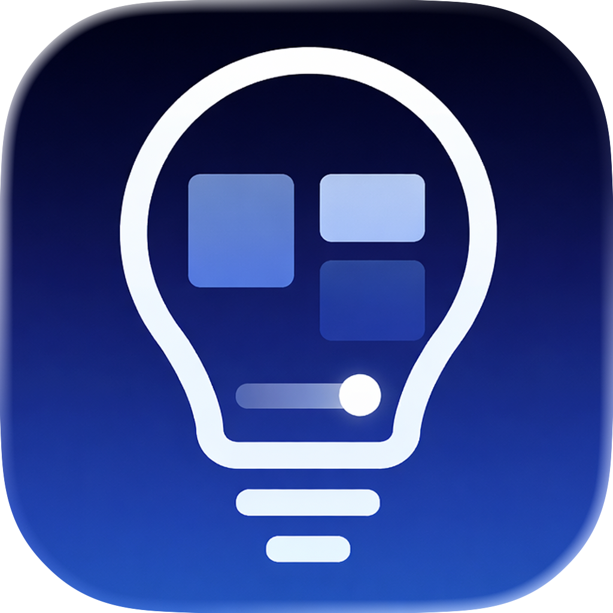

# DMX Dashboard



#### A desktop lighting controller with dashboard‑style UI to manage DMX fixtures, Looks, live overrides, and HTP blending. Supports multiple devices, users, and dashboards.

## Download

- [Download DMX Dashboard](../../releases)


## Install

- macOS: open the `.dmg` and drag **DMX Dashboard** to Applications
- Windows: run the `.exe` installer
- Linux: run the `.AppImage` (mark executable if needed)

## Quick Start

1. Open **Settings**
2. Create Fixture Profiles (Control Blocks)
3. Patch fixtures (universe + start address)
4. Build a Dashboard layout (sections + items)
5. Save Looks and start controlling

## Settings Overview

### Fixture Profiles (Control Blocks)

- Create a profile that matches your fixture’s channel order.
- Each profile is built from Control Blocks (Intensity, RGB/RGBW, CCT, Tint, Zoom, etc.).
- Defaults are stored per control block and used for Looks blending and Clear behavior.

### Fixtures (Patch)

- Assign each fixture a profile.
- Set **Universe** and **Start Address**.
- The patch viewer displays the active universe and used addresses.

### Looks

- Looks store target values per fixture and blend with defaults.
- Record a look from the current live output.
- Looks blend with other looks using HTP (highest value wins per channel).

### Dashboards

- Create multiple dashboards with custom layout.
- Each dashboard contains **sections** (Looks, Fixtures, or mixed).
- Each item can be configured with a UI type (toggle vs slider).
- Clear buttons can apply to Looks or Fixtures per section.

### Users & Access

Roles:
- **Viewer**: read-only, can view dashboards but cannot change values.
- **Controller**: can operate dashboards and fixtures.
- **Editor**: full access, can edit settings, layouts, and profiles.

Access options:
- Default role for new clients.
- Per-dashboard access control (optional explicit access).
- Access requests show up in **Users and Access**.

## Looks + Overrides (HTP)

- Looks blend from default values to saved targets.
- If you move a slider while a look is active, that channel enters override.
- Use **Clear** to release overrides and return to active Looks.

## Network Setup

- Choose sACN or Art-Net in **Settings → Network**.
- Set a bind address if you need a specific interface.
- Default server port is `3000`.

## Files & Config

- Configuration is stored on disk and saved automatically.
- On macOS it lives in your app data folder:
  `~/Library/Application Support/DMX Dashboard/config.json`

## Troubleshooting

- **No output?** Check network protocol, universe, and bind address.
- **Wrong fixture response?** Verify profile channel order + patch address.
- **Can’t connect?** Make sure the server port isn’t blocked by firewall.

## Build From Source

```
npm install
npm run electron:build
```

## License

Internal use for DMX Dashboard. Not for redistribution.
