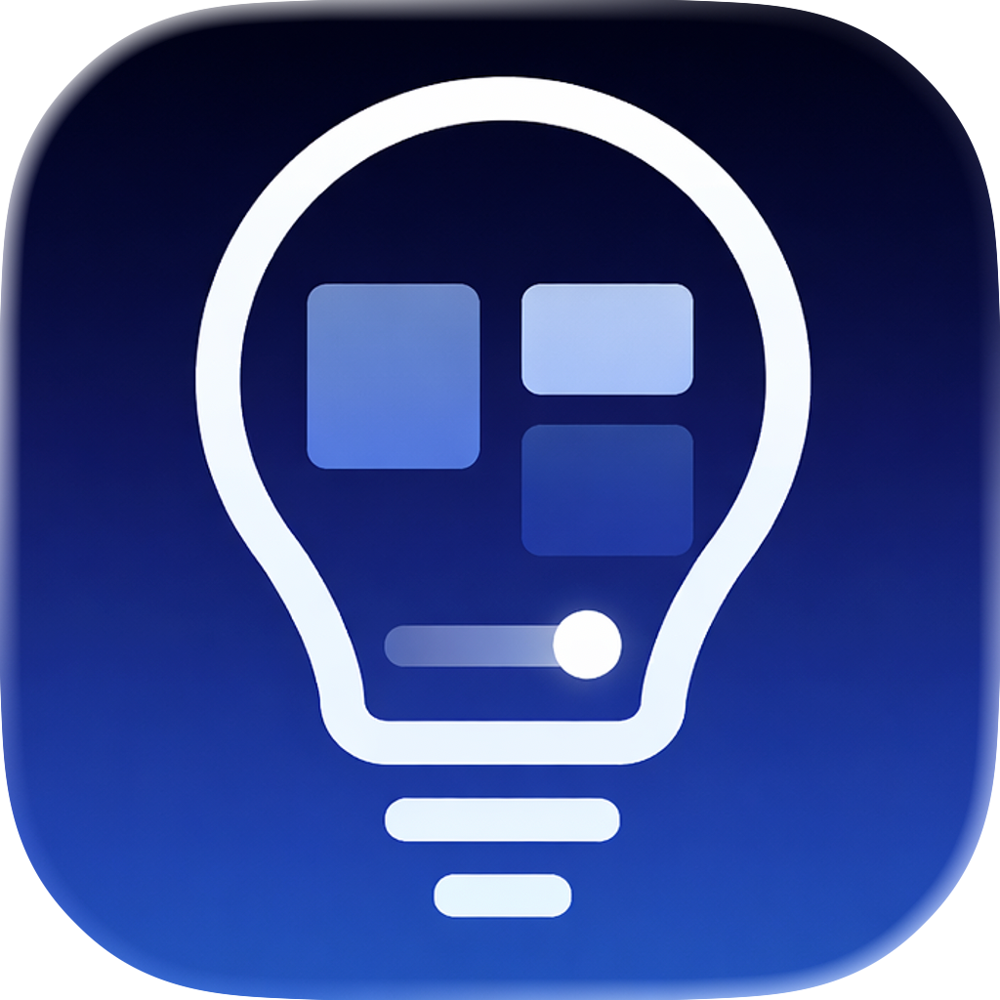

# DMX Dashboard



#### A desktop lighting controller with a modern dashboard UI for DMX fixtures, Looks, live overrides, and cue playback.

## Download

- [Download DMX Dashboard (latest release)](https://github.com/jshea2/DMX-Dashboard/releases/latest)

## What’s New (v1.1.x)

- Modern dashboard and settings visual redesign.
- New cue dock workflow with **GO**, **Back/Pause**, **Cue Out**, **Update Cue**, **Go to Cue**, and **Add Cue**.
- Cue list page with active/next cue status and transition progress visuals.
- Dashboard-level fixture and look editors (rename/reorder directly from dashboard).
- Per-look **UI Type** (`Slider`, `Toggle`, `Radio`) plus **Exclude from Cue Recording**.
- New control blocks including **Pan/Tilt 8-bit**, **Pan/Tilt 16-bit**, **CCT**, **Tint**, and **Dimmer + RGB**.
- Cross-platform Electron builds with auto-update support and release metadata.

## Core Features

### Dashboard Control

- Build dashboards from sections (Looks, Fixtures, Cue List, and custom).
- Clean live control UI with glow/gradient status on cards.
- Per-fixture clear and override behavior.
- Fixture profile link/sync mode for same-profile fixtures.

### Looks

- Looks are dashboard-scoped presets with HTP blending.
- Record from current output.
- Set look color accent and UI mode.
- Toggle whether Rec button appears in main dashboard UI.
- Optionally exclude specific looks from cue recording.

### Cue Lists

- Each dashboard can point to a cue list.
- Cues store fixture states and transition times.
- GO advances through selected cues, with pause/resume during transitions.
- Cue Out returns to fixture defaults/out state.
- Update Active Cue writes current overridden fixture state into active cue.
- Keyboard shortcut options per cue list: Spacebar GO, Shift+Spacebar Fast GO, Option/Alt+Spacebar Back/Pause.
- Default new cue transition time is configurable per cue list.

### Fixture Profiles + Patch

- Build profiles from control blocks and per-block defaults.
- Supported blocks include Intensity, RGB/RGBW, Dimmer + RGB, CCT, Tint, Zoom, Pan/Tilt (8-bit), and Pan/Tilt (16-bit).
- Patch fixtures by Universe and Start Address.
- Patch Viewer and DMX Output Viewer for verification.

### Multi-User Access

- Role-based access across dashboards: Viewer, Controller, Moderator, Editor.
- Global access matrix and per-dashboard access controls.
- Configurable default role for new clients.
- Local server identity is protected as editor.

### Networking + Output

- sACN (E1.31) and Art-Net output.
- Bind output to a specific network interface.
- Adjustable output FPS.

### Desktop App + Updates

- Runs as Electron app on macOS, Windows, and Linux.
- Optional auto-check for updates on launch.
- Offline-safe updater behavior (skips checks without internet).

## Install

- macOS: open `.dmg` and drag **DMX Dashboard** to Applications.
- Windows: run the `.exe` installer.
- Linux: run the `.AppImage` (mark executable if needed).

## Quick Start

1. Open **Settings**.
2. Create fixture profiles in **Fixture Profiles**.
3. Patch fixtures in **Patch**.
4. Configure dashboards and sections in **Dashboard** settings.
5. Build and record looks in **Looks**.
6. Configure cue list behavior in **Cue List**.
7. Return to dashboard and run live control.

## Settings Tabs

- **Dashboard**: dashboard layouts, sections, item assignment, look UI types, lock edit options.
- **Users and Access**: roles, permissions, per-dashboard matrix, pending requests.
- **Networking / IO**: protocol, interface bind, output tuning, update-check toggle.
- **Fixture Profiles**: control blocks and default values.
- **Patch**: fixture profile assignment, addressing, dashboard assignment.
- **Looks**: look creation, recording, color, visibility of rec button, cue exclusion.
- **Cue List**: cue shortcuts and default transition timing for new cues.
- **Export / Import**: save/load full config JSON.

## Data + Config

Configuration is saved automatically.

- macOS: `~/Library/Application Support/DMX Dashboard/config.json`
- Windows: `%APPDATA%/DMX Dashboard/config.json`
- Linux: `~/.config/DMX Dashboard/config.json`

## Reset to Defaults

- Use **Settings → Export / Import → Reset** to restore default app settings.
- This action replaces current configuration.

## Build From Source

```bash
npm install
npm run electron:build
```

## Release Build (Recommended)

```bash
npm run electron:build:release
```

This generates release-ready assets in `dist/release`.

## Publishing Releases

1. Go to: https://github.com/jshea2/DMX-Dashboard/releases
2. Draft a new release.
3. Use tag format: `vX.Y.Z` (example: `v1.1.1`).
4. Upload all files from `dist/release` (including `latest*.yml` and `.blockmap` files).
5. Publish release.

## Troubleshooting

- No output: verify protocol, universe, destination, and bind interface.
- Wrong fixture behavior: verify profile channel order and patch addressing.
- Update issues: ensure release includes required `latest*.yml` metadata and matching artifacts.

## License

Internal use for DMX Dashboard. Not for redistribution.
